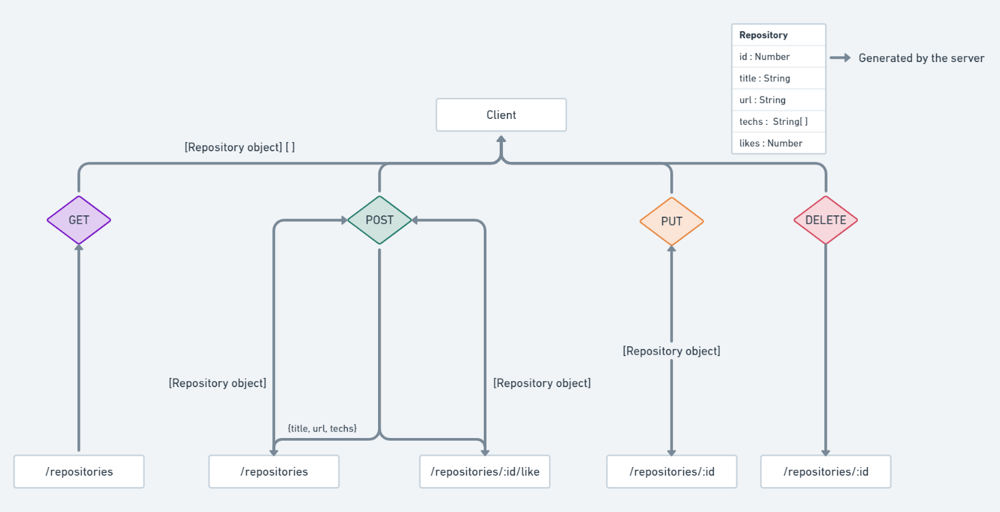

# RocketSeat NodeJS Backend Excercise

The first exercise for the GoStack bootcamp (11th edition). A simple introductory application that presents the NodeJS backend with ExpressJS. In its simplicity, the data is stored in memory as the app functions solely for demonstration purposes.

### Idea

This application will allow the users to register data about project repositories, the technologies used in them, their repository link, title and will also allow users to upvote a repository.

### Aplication Routes

This application contains the following routes:

- **`GET /repositories`**: This route receives no data and returns the collection of `repositories` to the client.

- **`POST /repositories`**: This route creates a new repository. It must receive in its request body, a **`Repository`** object, containing, `title`, `url` and an array of `techs`. The `id` (actually an uuid) will be generated by the server and the number of upvotes (likes) will be initialized at the count of 0. This route will return the recently created `repository`.

  **Ex**:

  ```json
  {
    "title": "Electron",
    "link": "https://github.com/electron/electron",
    "techs": [
      "C++",
      "TypeScript",
      "Objective-C",
      "JavaScript",
      "HTML",
      "Python"
    ]
  }
  ```

- **`POST /repositories/:id/like`**: This route will receive the target's `id` as a route parameter and will create an upvote registry. This route is supossed to simulate the creation of a record in the database, which may also hold the id of those who upvoted the repository. This route will return the upvoted `repository`.

- **`PUT /repositories/:id`**: This route will receive the repository's `id` as a route parameter and the data to be altered as the request body. The body's data is entirely optional and only that of which was passed will be updated. This route will return the recently updated `repository`.

  **Ex**:

  ```json
  {
    "title": "Pudding"
  }
  ```

- **`DELETE /repositories/:id`**: This route will receive the target repository's `id` as a query parameter and remove it from the registry. This route will return only a status code.

### Diagram

A chart preseting the route parameters, data direction and **`Repository`** UML is displayed below.



### Running and Testing

This application will can be executed with the command `yarn dev` (if you use yarn) or `npm run dev` and can be tested with via Jest.js through the commands `yarn test` or `npm run test`. The server will run on the port `3333` by default. (You can alter it in the `src/server.js` file)
